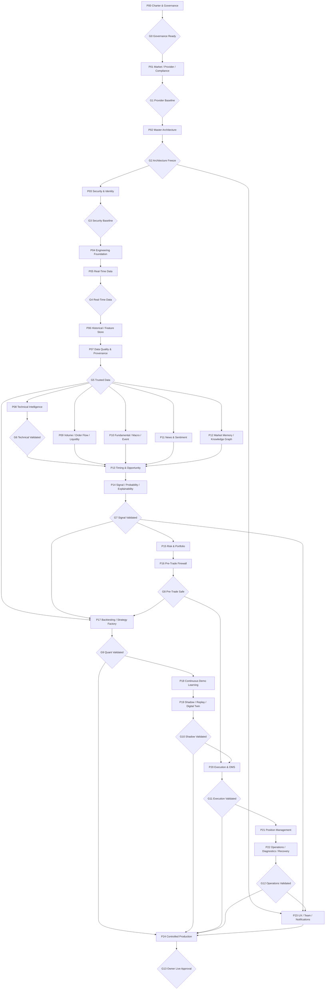

# Finance / NEXUS QUANT — Dependency Graph

STATE = GOVERNED_COMPANION  
TASK = `FIN-P00-WE-001`

## 1. Purpose

This document defines **hard dependencies**, major parallelization opportunities and the critical gate path. It is not a schedule promise.

## 2. Phase dependency graph

## 3. Dependency classes

### Hard dependency

A downstream workstream cannot be considered READY until the upstream artifact/gate exists.

Examples:
- P05 implementation requires P02 architecture freeze, P03 security baseline and P04 engineering foundation.
- P14 calibration cannot be trusted before P07 trusted-data evidence.
- P16 Pre-Trade Firewall depends on P15 risk policy and P14 signal contracts.
- P24 cannot advance past research/demo/shadow/execution/operations gates.

### Interface dependency

Downstream exploratory work may begin against a draft contract, but canonical completion waits for the upstream interface to freeze.

Example:
- P23 Figma exploration may start after P02 interaction contracts are drafted, but final UX integration waits for stable signal/risk/operations contracts.

### Evidence dependency

Implementation may exist, but phase closure requires another phase's evidence.

Example:
- P20 OMS may be implemented in simulation before G10, but execution validation cannot support production progression until shadow/digital-twin evidence is available.

### Human-gate dependency

Automation must stop at the explicit human approval point.

Example:
- G13 requires Owner approval; no agent, model, CI job or plugin may grant it.

## 4. High-value parallel lanes

After `G5_TRUSTED_DATA`, four intelligence lanes may proceed with coordinated schemas:

- P08 Technical Intelligence
- P09 Order Flow / Liquidity
- P10 Fundamental / Macro
- P11 News / Sentiment
- selected P12 memory foundations

P09–P12 should converge into the common evidence model before P13/P14.

After P02, design exploration in P23 may proceed in parallel, but implementation claims remain provisional until downstream contracts stabilize.

Security, evidence and operations reviews should be continuous cross-cutting activities rather than end-of-project checks.

## 5. Critical shared dependencies

### Clock and event-time semantics

P05 normalization must establish canonical:
- exchange/provider event time;
- receive time;
- processing time;
- timezone and trading-session semantics;
- sequence/gap handling.

P06/P07/P08/P09/P10/P17/P19 all depend on these semantics.

### Instrument identity

A stable instrument/venue/symbol master begins in P01 and is canonicalized in P05. It is shared by storage, features, intelligence, risk, execution and UI.

### Provenance and versioning

P06/P07 must make data version/provenance available before P14/P17/P18/P19 can claim reproducibility.

### Evidence contract

P08–P12 produce heterogeneous evidence that must converge on P14's evidence contract. P13 timing/ranking adds eligibility/context but does not erase provenance.

### Risk contract

P15 outputs deterministic risk limits/verdicts consumed by P16 and P20/P21.

### Execution identity

P16/P20/P21 share stable intent/order/position correlation IDs so duplicate prevention, reconciliation and replay can be deterministic.

## 6. Non-skippable progression

The following progression is a governance invariant:

`Research → Backtest → Demo → Shadow → Manual/Semi-Auto → Micro-Capital/Canary → Controlled Auto`

A stage may be repeated, repaired or rolled back. It may not be skipped.

## 7. Failure dependencies

If an upstream safety gate regresses after later work has begun:

- affected downstream tasks become `BLOCKED` or `PAUSED`;
- Live/Canary automation fails closed if applicable;
- A0 identifies impacted contracts/tasks;
- A10 records the evidence chain;
- repair must restore the upstream invariant before dependent progression resumes.

## 8. Current critical path

At the time of this task:

`FIN-P00-WE-001 → P00-F Governance Closure → G0 → P01`.

No implementation code is authorized before the roadmap package and G0 governance closure are canonical.
