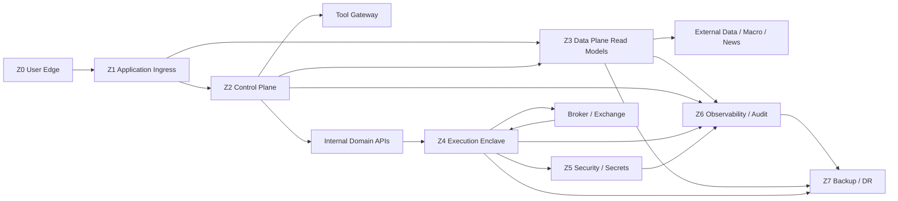

# NEXUS QUANT — Environment / Network / DR Topology

STATE = P02-G BASELINE  
TASK = `FIN-P02-WG-001`  
PHASE = `P02 — Master Architecture`

## 1. Objective

Define the logical deployment, trust-zone and disaster-recovery topology before choosing any cloud, country, region, firewall, VPN, KMS, database or queue product.

The topology is country-neutral and provider-portable.

## 2. Environments

NEXUS QUANT uses:

- DEV
- TEST
- RESEARCH
- DEMO
- SHADOW
- CANARY
- LIVE

Environment separation means separation of:
- authority;
- credentials;
- account scope;
- mutable state;
- deployment eligibility;
- audit context.

It is not merely a naming convention.

### DEV
Engineering only. Mock execution. No real account access.

### TEST
Automated integration/security/contract testing. Simulated execution only.

### RESEARCH
Historical/backtest/experimentation. Read-only market data if licensed. No execution.

### DEMO
Paper/practice execution and permanent learning. No real capital.

### SHADOW
May observe real market conditions and generate parallel decisions, but has **no live command path**.

### CANARY
Reserved for future micro-capital proving. Disabled in P02. Separate credentials later.

### LIVE
Reserved for later controlled production. Disabled in P02. Separate credentials later.

## 3. Trust zones

### Z0 — User Edge
Owner/team browser/mobile clients.

May reach only the controlled application ingress.

Cannot reach execution, secrets, data storage or DR directly.

### Z1 — Application Ingress
Authenticated application/API boundary.

May call authorized internal APIs and read models.

Cannot directly call broker/exchange order endpoints or secrets.

### Z2 — Control Plane
Governance, agents, orchestration and workflow control.

No direct public exposure.

May access domain APIs and Tool Gateway under policy.

Cannot mutate broker state outside the execution path.

### Z3 — Data Plane
Market-data adapters, canonical events, storage, features and research data.

May perform controlled outbound access to data/macro/news providers.

Cannot send live orders.

### Z4 — Execution Enclave
Risk / Firewall / OMS / execution adapters / reconciliation.

This is the most restricted application zone.

Only validated internal execution contracts may enter.

Broker/exchange order traffic originates here.

### Z5 — Security / Secrets
Identity, authorization and secret-management boundary.

Secrets are resolved by scoped handles.

No bulk or ambient secret access.

### Z6 — Observability / Audit
Logs, metrics, traces, security events and immutable evidence references.

All zones may emit controlled telemetry here.

Observability does not gain business authority.

### Z7 — Backup / DR
Backup copies, restore manifests and recovery staging.

Restricted access and separate recovery controls.

## 4. External boundaries

### Market-data providers
Outbound from controlled adapter boundary.

### Macro / News
Outbound fetch or validated callback.

Inbound content is untrusted data.

### Broker / Exchange
Only the Execution Enclave may submit execution commands.

Inbound ack/fill/status messages are validated and reconciled by OMS.

### Model / Tool Services
Reached through the Tool Gateway.

They do not gain project authority.

## 5. Environment promotion

Promotion is artifact-first.

Promote:
- immutable build artifact;
- model/config version;
- test/eval evidence;
- rollback target.

Do not promote:
- ambient credentials;
- local mutable state;
- hidden agent memory.

Moving an artifact to a higher environment does not automatically increase agent or risk authority.

## 6. Cross-environment rules

Forbidden by default:
- non-production writes into CANARY/LIVE authoritative state;
- copying LIVE/CANARY credentials into lower environments;
- copying real account/order state downward without sanitization;
- restoring production backup into lower environment without explicit transformation.

Allowed only when governed:
- read-only replication of licensed market/reference data;
- sanitized fixtures;
- immutable code/model/config artifacts.

## 7. Execution path

`Signal/Risk/Firewall → Z4 OMS → Z4 Provider Adapter → Broker/Exchange → Validated Provider Event → OMS Reconciliation → Z6 Audit`

Public/UI/Agent text cannot enter the broker path directly.

## 8. Disaster-recovery classes

### DR0 — Execution Authority State
Highest priority.

Includes:
- ApprovedTradeIntent;
- OMS lifecycle;
- fills;
- positions;
- Risk/Firewall verdicts;
- kill-switch state;
- critical security/audit events.

After recovery, external broker truth must be reconciled before new risk-increasing execution.

### DR1 — Control / Security State
Includes:
- Task/workflow state;
- agent checkpoints;
- policy/config references;
- identity/security state;
- audit manifests.

Resume requires integrity and authorization validation.

### DR2 — Market / Historical / Research Data
Includes:
- raw/canonical history;
- macro vintages;
- replay datasets;
- features;
- model artifacts.

Restore requires manifest/hash validation and licensing compliance.

### DR3 — Rebuildable Derived State
Includes:
- caches;
- read models;
- temporary projections.

May be rebuilt from authoritative sources.

Numerical RPO/RTO is defined later in P02-H/P22.

## 9. Logical DR topology

Primary:
`SITE_A_LOGICAL`

Recovery:
`SITE_B_LOGICAL_OR_EQUIVALENT_RECOVERY_TARGET`

No country or provider is selected.

A backup in the same failure domain does not count as full DR.

Required properties later:
- versioned backups;
- off-primary copy;
- integrity manifests;
- restore staging/quarantine;
- restore drills.

## 10. Recovery sequence

1. Enter HALTED or SAFE_MODE.
2. Restore identity/security/control dependencies.
3. Validate config/policy versions.
4. Restore authoritative execution/audit state.
5. Reconcile broker/exchange orders/fills/positions/balances.
6. Restore and validate market/data-quality state.
7. Rebuild mutable projections.
8. Revalidate agent checkpoints/tools/permissions.
9. Run health/integrity checks.
10. Re-enable read-only/research paths first where safe.
11. Obtain required authorization before risk-increasing execution.
12. Move RECOVERY → NORMAL only after checks pass.

## 11. Failover rules

Infrastructure failover is not execution failover.

Provider/broker failover still follows ADR-0010:
- halt;
- reconcile;
- resolve uncertainty;
- recompute Risk;
- fresh Firewall approval.

If Secrets integrity is unknown → execution halted.

If Audit/Evidence is unavailable beyond policy threshold → high-risk actions fail closed.

If critical Data Quality is unknown → trade decision path fails closed.

## 12. Logical topology

## 13. Safety

No cloud selected.  
No region/country selected.  
No infrastructure provisioned.  
No accounts/credentials created.  
CANARY = DISABLED  
LIVE = DISABLED  
AUTO_TRADING = DISABLED
