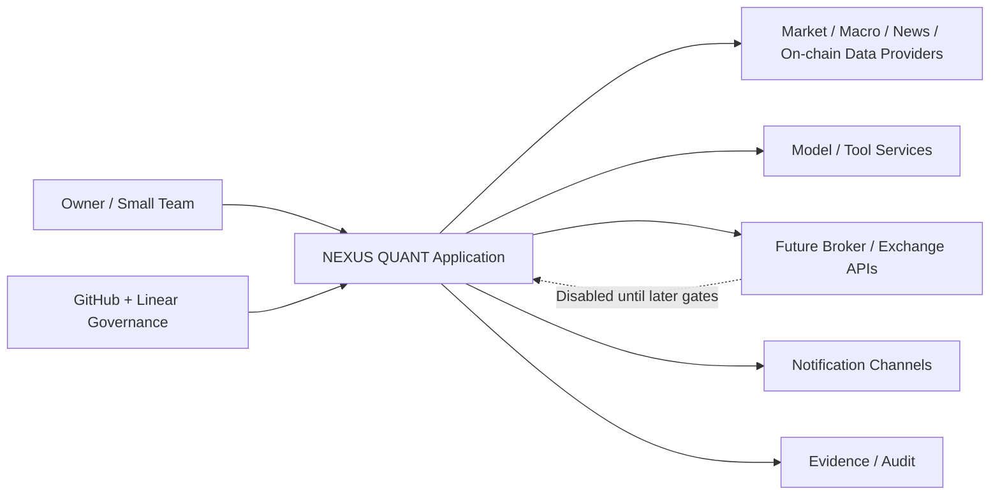
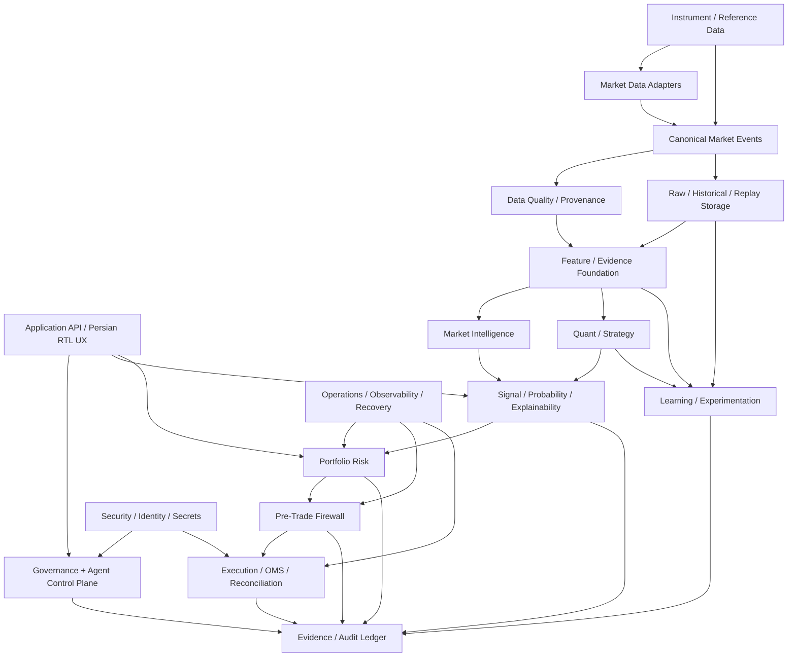
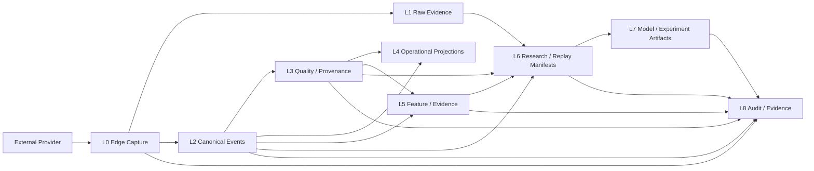
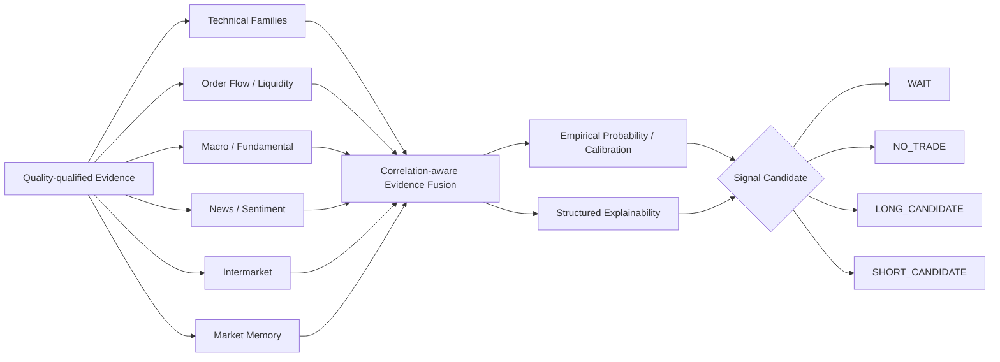
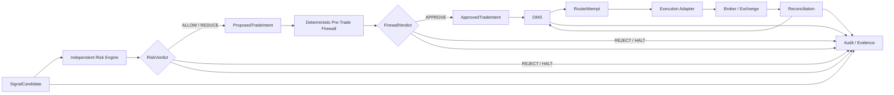
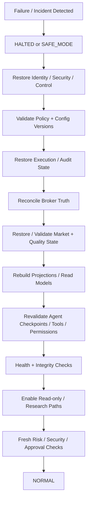
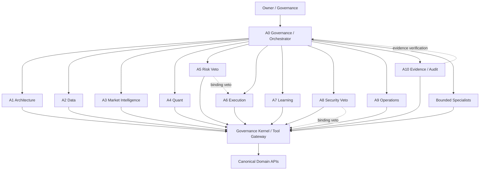

# NEXUS QUANT — P02 Architecture Diagrams

STATE = P02-I REVIEW ARTIFACT  
TASK = `FIN-P02-WI-001`  
GATE = `G2_ARCHITECTURE_FREEZE`

These diagrams are logical architecture views. They do not select a cloud, region, database, queue, broker, model vendor or production account.

---

## 1. System Context

Key rule: external systems are providers of data/services. They do not define NEXUS QUANT authority.

---

## 2. Containers / Logical Modules

Logical modules do not imply one microservice per box.

---

## 3. Data Flow

Corrections/revisions append new truth versions rather than silently rewriting what was previously observed.

---

## 4. Decision Flow

Multiple correlated indicators do not count as multiple independent confirmations.

Numeric probability is empirical/calibrated or unavailable; it is never generated from LLM narrative confidence.

---

## 5. Execution Path

No Strategy, Agent, UX component or model has a direct broker path.

Timeout is not proof of rejection. UNKNOWN execution state requires reconciliation before retry/reroute.

---

## 6. Recovery Path

Infrastructure recovery is not execution authorization. External execution truth must be reconciled first.

---

## 7. Agent Interaction / Authority

Agent consensus cannot override A5 or A8.

Tool availability is not permission.

Specialists are bounded, catalog-listed and ephemeral by default.

---

## Diagram review result

| Diagram | Status |
|---|---|
| System context | PASS |
| Containers/modules | PASS |
| Data flow | PASS |
| Decision flow | PASS |
| Execution path | PASS |
| Recovery path | PASS |
| Agent interaction | PASS |

All seven diagram classes required by the Execution Roadmap are present.

LIVE_TRADING = DISABLED  
AUTO_TRADING = DISABLED
